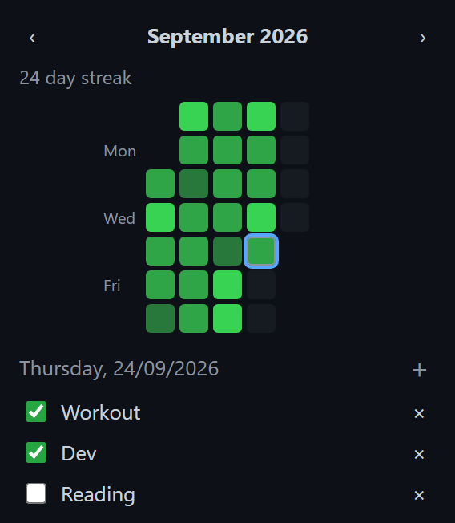

# GMI — Gonna Make It

A minimal habit tracker for Chrome with a GitHub-style heatmap. Tick off your habits each day and watch the month fill up with green.

## Install

1. Download or clone this folder.
2. Open `chrome://extensions` and turn on **Developer mode** (top right).
3. Click **Load unpacked** and select the `GMI` folder.
4. Pin GMI from the puzzle-piece menu so it's one click away.

## How to use

- **Add a habit:** click **+**, type a name, press **Enter** (**Esc** cancels).
- **Check off a habit:** tick its box. Only today's habits can be checked or unchecked; past days are read-only.
- **Read the heatmap:** each square is a day. The more habits you finished that day, the brighter the green. Hover over a square to see the count, e.g. `2/3 habits`.
- **Look back:** click any square to see which habits you finished that day. Use **‹ ›** to change month.
- **Streak:** the counter at the top shows how many days in a row you've completed at least one habit.
- **Delete a habit:** click **×** next to it and confirm.

Everything is saved in your browser with `chrome.storage.local`. Nothing leaves your machine.
